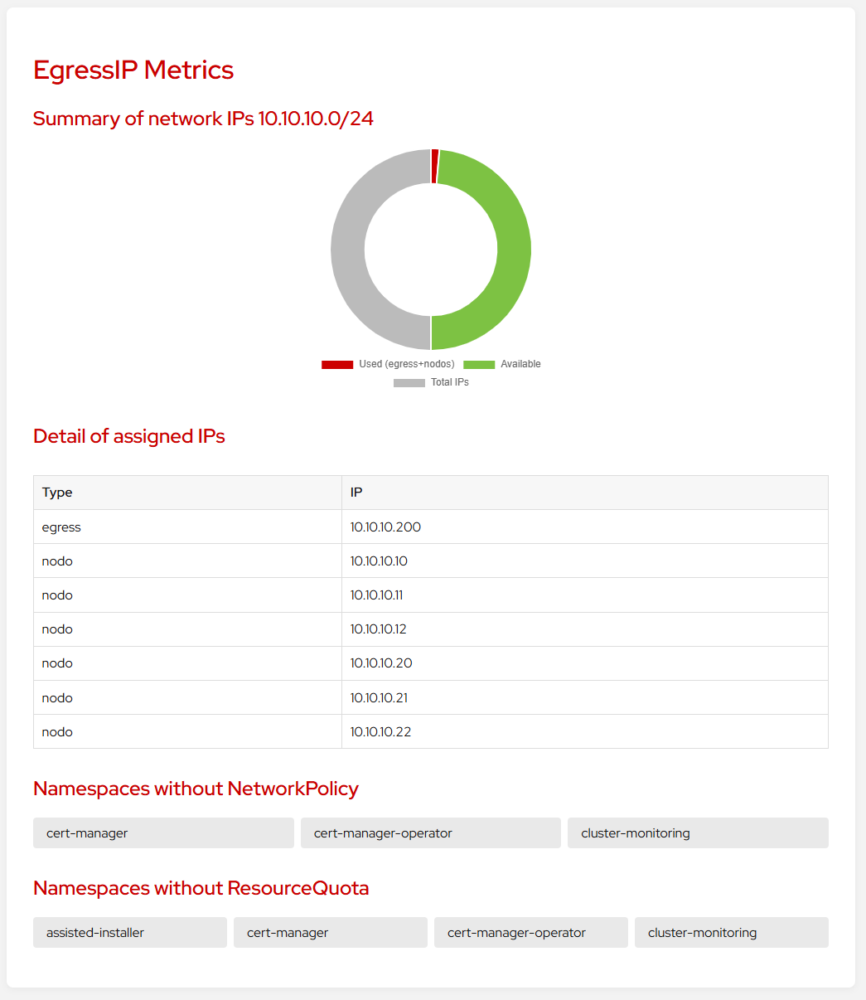
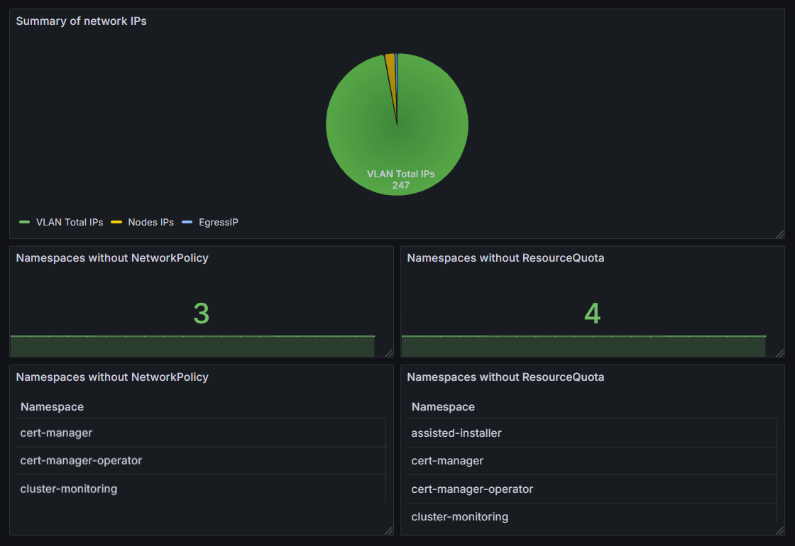

# Cluster Custom Metrics

**Docker Hub:**
[](https://hub.docker.com/r/jorgeandrada/cluster-custom-metrics)
[](https://hub.docker.com/r/jorgeandrada/cluster-custom-metrics)

**Quay.io:**
[](https://quay.io/repository/jandradap/cluster-custom-metrics)
[](https://quay.io/repository/jandradap/cluster-custom-metrics)

**Info:**
[](https://codecov.io/github/jandradap/cluster-custom-metrics)
[](https://deepwiki.com/jandradap/cluster-custom-metrics)

## Overview

**Cluster Custom Metrics** is a Kubernetes/OpenShift monitoring component designed to export and expose custom metrics not available by default in the Prometheus stack (user-workload-monitoring). It allows teams to monitor specific cluster behaviors and configurations such as unused namespaces, IP availability, or missing resource quotas.



## Features

* Export custom metrics as Prometheus endpoints.
* Compatible with OpenShift and Kubernetes.
* Easily extensible with your own metrics.
* Lightweight and containerized.
* Detect unbound and pending PVCs.
* Identify single-replica or un‑resourced workloads.
* Report workloads using privileged ServiceAccounts.

## Architecture

This component is deployed as a Kubernetes Deployment and configured with a ConfigMap that provides Python-based metric collectors. The deployment exposes `/metrics` endpoint for Prometheus scraping.




## Prerequisites

* Kubernetes or OpenShift cluster (recomended)
* Prometheus Operator installed
* Access to create namespaces, configmaps, and deployments

## Installation

1. Clone the repository:

   ```bash
   git clone https://github.com/jandradap/cluster-custom-metrics.git
   cd cluster-custom-metrics
   ```

2. Apply required manifests from the deploy directory:

   ```bash
   oc apply -f deploy/namespace.yaml
   oc apply -f deploy/configmap.yaml
   oc apply -f deploy/deployment.yaml
   oc apply -f deploy/service.yaml
   oc apply -f deploy/servicemonitor.yaml
   ```

3. Verify the pod is running:

   ```bash
   oc get pods -n cluster-monitoring
   ```

4. For user workload monitoring and Grafana configuration, see [grafana/Readme.md](grafana/Readme.md)

## Configuration

Modify the `configmap.yaml` to change or add Python scripts that collect metrics. Each script must define and expose Prometheus metrics using `prometheus_client`.
You can enable or disable individual metrics using `enabled_features` and control how often the exporter refreshes data with the `update_seconds` key:

```yaml
data:
  config.json: |
    {
      "subnet": "10.10.10.0/24",
      "exclude_namespaces": ["openshift-*", "kube-*"],
      "enabled_features": {
        "np": true,
        "quota": true,
        "pv_unbound": true,
        "pvc_pending": true,
        "single_replica": true,
        "no_resources": true,
        "priv_sa": true,
        "no_antiaffinity": true
      },
      "update_seconds": 60,
      "scc_types": ["restricted", "anyuid", "hostaccess", "hostmount-anyuid", "privileged"]
    }
  ```

## Usage

The service exposes metrics at `http://<service-name>.<namespace>.svc.cluster.local:8080/metrics`. Prometheus will automatically scrape this endpoint using the `ServiceMonitor`.

## Metrics

| Metric | Description | Labels | Example |
|-------|-------------|--------|---------|
| `ip_pool_total` | Total IPs available in the VLAN | - | `ip_pool_total 254` |
| `ip_pool_used` | IPs in use (egress+nodes) | - | `ip_pool_used 21` |
| `egressips_used` | IPs assigned to egress IP objects | - | `egressips_used 10` |
| `nodesips_used` | Node internal IPs in use | - | `nodesips_used 11` |
| `namespaces_without_networkpolicy_total` | Namespaces missing a NetworkPolicy | - | `namespaces_without_networkpolicy_total 2` |
| `namespace_without_networkpolicy` | Namespace without NetworkPolicy | `namespace` | `namespace_without_networkpolicy{namespace="dev"} 1` |
| `namespaces_without_resourcequota_total` | Namespaces missing a ResourceQuota | - | `namespaces_without_resourcequota_total 3` |
| `namespace_without_resourcequota` | Namespace without ResourceQuota | `namespace` | `namespace_without_resourcequota{namespace="dev"} 1` |
| `pv_unbound_total` | PersistentVolumes not bound to any PVC | - | `pv_unbound_total 1` |
| `pv_unbound` | Specific unbound PV | `pv` | `pv_unbound{pv="pv1"} 1` |
| `pvc_pending_total` | PVCs stuck in Pending state | - | `pvc_pending_total 2` |
| `pvc_pending` | Specific pending PVC | `namespace`,`pvc` | `pvc_pending{namespace="dev",pvc="data"} 1` |
| `workloads_single_replica_total` | Workloads running with fewer than 2 replicas | - | `workloads_single_replica_total 1` |
| `workload_single_replica` | Workload with one replica | `namespace`,`app`,`kind` | `workload_single_replica{namespace="dev",app="web",kind="deployment"} 1` |
| `workloads_no_resources_total` | Workloads missing resource requests and limits | - | `workloads_no_resources_total 1` |
| `workload_no_resources` | Workload without full resources | `namespace`,`app`,`kind` | `workload_no_resources{namespace="dev",app="web",kind="statefulset"} 1` |
| `workloads_no_antiaffinity_total` | Workloads lacking anti-affinity rules | - | `workloads_no_antiaffinity_total 1` |
| `workload_no_antiaffinity` | Workload without anti-affinity | `namespace`,`app`,`kind` | `workload_no_antiaffinity{namespace="dev",app="web",kind="deployment"} 1` |
| `privileged_serviceaccount_total` | Workloads using privileged ServiceAccounts | - | `privileged_serviceaccount_total 1` |
| `privileged_serviceaccount` | Workload with privileged SA and SCC | `namespace`,`app`,`serviceaccount`,`scc` | `privileged_serviceaccount{namespace="dev",app="web",serviceaccount="sa",scc="privileged"} 1` |
|  | *Service accounts referenced by `system:openshift:scc:<name>` RoleBindings or ClusterRoleBindings are also mapped to their SCC* | |
| `routes_cert_expiring_total` | HTTPS routes with certificates nearing expiry | - | `routes_cert_expiring_total 1` |
| `route_cert_expiry_timestamp` | Days until route TLS certificate expiry (label `expiry_date` shows the date) | `namespace`,`route`,`host`,`expiry_date` | `route_cert_expiry_timestamp{namespace="dev",route="web",host="web.example.com",expiry_date="2025-06-30"} 120` |

## Testing

```bash
pip install -r tests/requirements.txt
PYTHONPATH=. pytest --cov=app tests/
```

These dependencies match those installed in `.github/workflows/ci.yml`.


## Testing

```bash
pip install -r tests/requirements.txt
PYTHONPATH=. pytest --cov=app tests/
```

These dependencies match those installed in `.github/workflows/ci.yml`.


## Contributing

See [CONTRIBUTING.md](CONTRIBUTING.md) for details on how to contribute.

## License

MIT License. See `LICENSE` file.