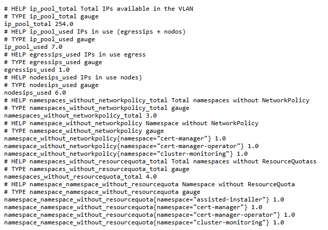

# Cluster Custom Metrics

**Docker Hub:**
[](https://hub.docker.com/r/jorgeandrada/cluster-custom-metrics)
[](https://hub.docker.com/r/jorgeandrada/cluster-custom-metrics)

**Quay.io:**
[](https://quay.io/repository/jandradap/cluster-custom-metrics)
[](https://quay.io/repository/jandradap/cluster-custom-metrics)

**Info:**
[](https://codecov.io/github/jandradap/cluster-custom-metrics)
[](https://deepwiki.com/jandradap/cluster-custom-metrics)

## Overview

**Cluster Custom Metrics** is a Kubernetes/OpenShift monitoring component designed to export and expose custom metrics not available by default in the Prometheus stack. It allows teams to monitor specific cluster behaviors and configurations such as unused namespaces, IP availability, or missing resource quotas.


## Features

* Export custom metrics as Prometheus endpoints.
* Compatible with OpenShift and Kubernetes.
* Easily extensible with your own metrics.
* Lightweight and containerized.

## Architecture

This component is deployed as a Kubernetes Deployment and configured with a ConfigMap that provides Python-based metric collectors. The deployment exposes `/metrics` endpoint for Prometheus scraping.




## Prerequisites

* Kubernetes or OpenShift cluster
* Prometheus Operator installed
* Access to create namespaces, configmaps, and deployments

## Installation

1. Clone the repository:

   ```bash
   git clone https://github.com/jandradap/cluster-custom-metrics.git
   cd cluster-custom-metrics
   git checkout develop
   ```

2. Apply required manifests:

   ```bash
   oc apply -f manifests/namespace.yaml
   oc apply -f manifests/configmap.yaml
   oc apply -f manifests/deployment.yaml
   oc apply -f manifests/service.yaml
   oc apply -f manifests/servicemonitor.yaml
   ```

3. Verify the pod is running:

   ```bash
   oc get pods -n cluster-monitoring
   ```

## Configuration

Modify the `configmap.yaml` to change or add Python scripts that collect metrics. Each script must define and expose Prometheus metrics using `prometheus_client`.

## Usage

The service exposes metrics at `http://<service-name>.<namespace>.svc.cluster.local:8080/metrics`. Prometheus will automatically scrape this endpoint using the `ServiceMonitor`.

## Contributing

See [CONTRIBUTING.md](CONTRIBUTING.md) for details on how to contribute.

## License

MIT License. See `LICENSE` file.
